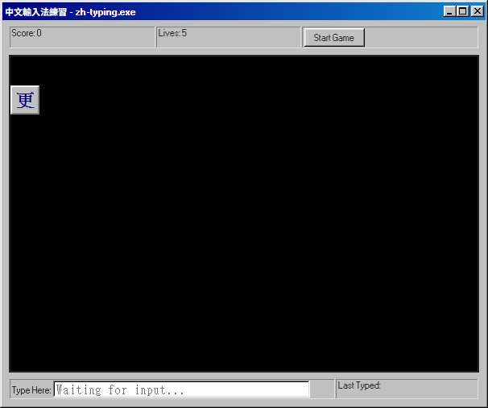

# 中文輸入法練習 (Retro Windows 95/98 Replica)

A browser-based, zero-installation replica of the classic Windows 95/98 built-in Chinese typing game.

This project faithfully recreates the nostalgic 1990s aesthetic—battleship gray UIs, pixelated fonts, and motherboard beeps—while modernizing the underlying engine so it runs seamlessly on any modern device using pure Vanilla JavaScript, HTML5, and CSS3.

## Features
* **Zero Dependencies**: Pure HTML, CSS, and JS. No bundlers or build tools required.
* **Retro UI**: Powered by [98.css](https://jdan.github.io/98.css/) for that authentic Windows 98 look and feel.
* **Native IME Support**: Deep integration with modern browser Composition Events (`compositionstart`, `compositionend`) allows you to use your OS's native Input Method Editor (Bopomofo, Cangjie, Pinyin, etc.) without dropping keystrokes.
* **Classic Gameplay Mechanics**:
  * 3D blocks fall in a grid.
  * Correctly typing a block shoots a red line through it, and it floats away as a "ghost".
  * Missed blocks stack up at the bottom.
  * If the blocks reach the top of the canvas, you lose a life.
* **Web Audio API**: Synthesized square-wave retro motherboard beeps for authentic audio feedback.

## How to Play
There are no servers or compilers to set up.
1. Clone this repository or download the source code.
2. Open `index.html` directly in any modern web browser.
3. Click **Start Game**.
4. Switch to your preferred Chinese IME and start typing the falling characters!

## Project Structure
* `index.html`: The main interface structure and layout.
* `style.css`: Custom retro styling and grid definitions.
* `game.js`: The Vanilla JS game engine handling the canvas, Web Audio, IME interception, and collision physics.
